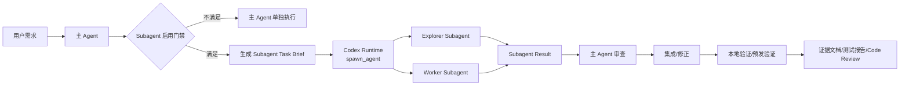

# OPC Skills Subagent Runtime 调用技术方案

## 0. 文档状态

- 状态：方案草案，已补充 skill 到 runtime tool call 的实际调用路径，等待用户 review。
- 日期：2026-07-18。
- 目标：解释 `opc-skills` 如何从“概念 Agent”升级到“可执行 subagent 编排”，并给出主 Agent 调用 subagent 的具体例子。
- 非目标：不把 subagent 做成 shell 命令；不依赖 git hooks 自动启动；不让 subagent 执行生产发布、数据库迁移、环境变量修改或破坏性清理。

## 1. 核心结论

Codex 的 subagent 不是 shell、hooks 或仓库脚本，而是 Codex Runtime 提供的内部多 Agent 工具能力。主 Agent 通过运行时工具启动和管理子 Agent。

当前可用的运行时工具形态是：

```text
multi_agent_v1.spawn_agent   启动 subagent
multi_agent_v1.send_input    给已有 subagent 继续发任务
multi_agent_v1.wait_agent    等待 subagent 完成
multi_agent_v1.close_agent   关闭不再需要的 subagent
```

这些工具由 Codex 运行时暴露给主 Agent，不是仓库里的命令，也不是用户在 shell 里执行的命令。`SKILL.md` 只能要求主 Agent 在满足条件时调用这些工具。

`opc-skills` 的职责不是替代这些工具，而是规定：

- 什么时候允许调用 subagent。
- 应该调用哪类 subagent。
- task brief 怎么写。
- 可读、可写和禁止范围怎么定义。
- subagent 输出如何被主 Agent 验收。
- 如何衡量这次拆分是否真的提高速度或质量。

## 2. 运行时架构



这里有三个边界要特别明确：

1. `agents/*.md` 是角色定义文件，不会自动运行。
2. `templates/*.md` 是任务包模板，不会自动运行。
3. 真正启动 subagent 的动作，只能由主 Agent 调用 Codex Runtime 的 `spawn_agent` 完成。

## 3. 和 shell、hooks、scripts 的关系

| 机制 | 是否负责启动 subagent | 作用 |
| --- | --- | --- |
| Codex Runtime `spawn_agent` | 是 | 真正创建 subagent 线程或任务。 |
| Shell | 否 | 主 Agent 或 subagent 用来执行 `rg`、`npm test`、`git diff` 等具体命令。 |
| Git hooks | 否 | 做 pre-commit、pre-push、测试门禁。 |
| 仓库 scripts | 否 | 生成 task brief、跑 mock gate、执行稳定验证命令。 |
| `opc-skills/agents/*.md` | 否 | 定义 subagent 角色说明、约束和输出格式。 |
| `opc-skills/templates/*.md` | 否 | 定义任务包和结果模板。 |

推荐心智模型：

```text
主 Agent 读取 opc-skills 规则
  -> 判断是否值得拆
  -> 读取 agents/frontend-agent.md
  -> 填写 subagent-task-brief
  -> 调用 spawn_agent
  -> subagent 用 shell/apply_patch/tests 完成子任务
  -> 主 Agent wait_agent 获取结果
  -> 主 Agent 审查、集成、验证、提交
```

### 3.1 `SKILL.md` 中如何“调用”subagent

严格说，`SKILL.md` **不能直接调用** subagent。它不是程序，也不会执行 shell、hooks 或脚本。`SKILL.md` 能做的是写一条强制行为规则，要求主 Agent 在满足条件时调用 Codex Runtime 工具。

也就是说，`SKILL.md` 里不能写成：

```bash
# 错误：不存在这种 shell 调用
codex subagent run frontend-agent
```

也不能写成：

```text
# 错误：skill 文件自己不会执行
当用户说开始时，自动启动 frontend-agent。
```

应该写成：

```markdown
## Subagent 调用规则

当用户明确允许 subagent、多 Agent 或并行执行，且任务满足 Subagent 启用门禁时，主 Agent 必须使用 Codex Runtime 的 `multi_agent_v1.spawn_agent` 工具启动 subagent。

启动前主 Agent 必须：

1. 读取对应的 `agents/<role>-agent.md`。
2. 使用 `templates/subagent-task-brief-template.md` 生成任务包。
3. 明确写出 subagent 的目标、上下文、可读范围、可写范围、禁止事项、验证命令和输出格式。
4. 调用 `multi_agent_v1.spawn_agent`，不得用 shell、hooks 或仓库脚本代替。
5. subagent 返回后，主 Agent 必须审查结果、集成改动、复跑验证并记录 evidence。
```

这段规则的含义是：

```text
SKILL.md 规则
  -> 约束主 Agent
  -> 主 Agent 决定调用工具
  -> Codex Runtime spawn_agent 创建 subagent
```

不是：

```text
SKILL.md
  -> 自己执行代码
  -> 自己启动 subagent
```

### 3.2 `SKILL.md` 推荐落地片段

下面这段可以直接放进 `opc-skills/SKILL.md` 的 `Subagent 执行模型` 中：

```markdown
**Subagent 调用不是 shell/hooks/scripts。** `opc-skills` 只能定义调用规则，不能自行执行 subagent。真正启动 subagent 必须由主 Agent 在运行时调用 Codex Runtime 工具 `multi_agent_v1.spawn_agent`。当且仅当用户明确允许 subagent、多 Agent 或并行执行，并且本节门禁全部满足时，主 Agent 才能读取 `agents/<role>-agent.md` 和 `templates/subagent-task-brief-template.md`，生成任务包，然后调用 `spawn_agent`。subagent 完成后，主 Agent 必须使用 `wait_agent` 获取结果，审查 ownership、分层边界、验证证据和无关改动，再决定是否集成。
```

这才是 “skills 中调用 subagent” 的真实实现方式：**skill 写规则，主 Agent 执行 runtime tool call**。

### 3.3 主 Agent 实际怎么执行

当 `opc-skills` 触发后，真正可执行的链路是：

```text
1. 主 Agent 读到 SKILL.md 的规则：
   “满足门禁时，用 multi_agent_v1.spawn_agent 调用 subagent。”

2. 主 Agent 读取编排准则：
   references/subagent-orchestration.md

3. 主 Agent 读取角色 prompt spec：
   agents/frontend-agent.md

4. 主 Agent 用模板生成任务包：
   templates/subagent-task-brief-template.md

5. 主 Agent 发起 Codex Runtime 工具调用：
   tool = multi_agent_v1.spawn_agent

6. Runtime 返回 agent id。

7. 主 Agent 后续用 wait_agent/send_input/close_agent 管理这个 agent。
```

也就是说，`agents/frontend-agent.md` 不是“被执行的脚本”，而是主 Agent 填充 `spawn_agent.message` 时引用的角色说明。

一次工具调用的参数长这样：

```json
{
  "agent_type": "worker",
  "fork_context": false,
  "message": "你是 OPC Frontend Agent。你不是独自在代码库里工作，不要 revert 他人改动。\\n\\n业务目标：...\\n\\nOwnership：...\\n\\n验证：...\\n\\n输出要求：按 templates/subagent-result-template.md 返回。"
}
```

`agent_type` 来自 Runtime 支持的类型，常用值是：

- `explorer`：只读代码问题、影响面、现有实现和证据探索。
- `worker`：有明确 ownership 的代码或测试修改。
- `default`：不适合明确归类时才使用。

除非用户明确要求不同模型，主 Agent 不应该设置 `model`，让 subagent 继承当前模型即可。

## 4. 建议目录结构

第一阶段建议在 `opc-skills` 内部新增角色和模板文件，不把每个 subagent 做成独立 skill。

```text
opc-skills/
├── SKILL.md
├── agents/
│   ├── explorer-agent.md
│   ├── frontend-agent.md
│   ├── backend-agent.md
│   ├── qa-agent.md
│   ├── integration-agent.md
│   └── devops-agent.md
├── templates/
│   ├── subagent-task-brief-template.md
│   └── subagent-result-template.md
├── references/
│   ├── agent-workflow.md
│   └── subagent-orchestration.md
└── docs/
    ├── subagent-optimization-plan.md
    └── subagent-runtime-invocation-design.md
```

原因：

- 主规则仍由 `SKILL.md` 统一约束。
- agent 文件只作为 prompt spec，被主 Agent 读取后塞进任务包。
- 等某个 agent 经过多轮实战证明稳定，再考虑拆成独立 skill。

## 5. 启用门禁

主 Agent 调用 subagent 前，必须先完成以下判断。

### 5.1 必须满足

- 用户明确允许 subagent、多 Agent 或并行执行。
- 子任务可以独立完成。
- 子任务能并行推进，或能明显提高审查质量。
- ownership 清楚：可读范围、可写文件、禁止修改范围都明确。
- 输出能被主 Agent 快速验收。
- 不涉及生产发布、数据库迁移执行、环境变量修改、回滚或破坏性清理。

### 5.2 禁止启动

- 目标还没澄清。
- 单文件小修或很小的 bug。
- 多个 worker 会修改同一文件。
- 子任务需要强依赖主 Agent 尚未完成的架构决策。
- subagent 结果无法被测试、diff、截图、日志或报告验证。

## 6. Runtime API 使用方式

下面是主 Agent 的 Runtime 工具调用参数示例。它不是 shell，不是 hook，也不是仓库脚本。

### 6.1 启动只读 Explorer

适用：让子 Agent 查代码影响面、接口定义、历史文档，不改代码。

```text
{
  "agent_type": "explorer",
  "fork_context": false,
  "message": "
你是 OPC Explorer Agent。

目标：
- 只读分析 dida-admin 的 /calendar-ops 页面涉及哪些 API、状态和测试文件。

可读范围：
- /Users/ysh/code/ai/didi-operator/dida-admin/src
- /Users/ysh/code/ai/didi-operator/dida-admin/scripts
- /Users/ysh/code/ai/didi-operator/dida-admin/docs/calendar-ops-workbench

禁止事项：
- 不修改任何文件。
- 不运行部署命令。
- 不访问生产服务。

输出要求：
- 相关文件列表。
- API 调用链。
- 可能缺失的测试点。
- 不确定项。
"
}
```

主 Agent 在 explorer 运行时，可以继续做不重叠工作，例如读后端代码或准备文档。

### 6.2 启动 Frontend Worker

适用：让子 Agent 修改前端页面和前端测试。必须给出非常窄的写范围。

```text
{
  "agent_type": "worker",
  "fork_context": false,
  "message": "
你是 OPC Frontend Agent。你不是独自在代码库里工作，其他人可能同时修改后端或文档。不要 revert 他人的改动。

业务目标：
- 日历运营页生成本月提示词时，必须覆盖整个月，而不是当前分页。
- 单日抽屉允许编辑存量文案。
- 提示词预览不能触发生图。

架构边界：
- dida-admin 只能调用 dida-core 的 admin API。
- 禁止在前端直接调用 dida-ai-service。
- 禁止把内部 Vercel deployment URL 写进前端代码。

可写范围：
- dida-admin/src/pages/CalendarOps.tsx
- dida-admin/src/services/api.ts
- dida-admin/scripts/calendar-ops-mock-gate.py
- dida-admin/src/**/*.test.ts 或 *.test.tsx

禁止修改：
- dida-core/**
- dida-ai-service/**
- Vercel 配置
- env 文件
- package 依赖，除非先说明原因

完成标准：
- 本月提示词 preview range 使用整月天数。
- mock gate 能断言跨分页日期，比如 2026-07-25。
- 单日文案保存调用 core BFF。
- 保存文案不触发生图。

验证命令：
- npm run test:run
- npm run build
- npm run calendar:mock-gate -- --base-url <local-dev-url>

输出要求：
- 修改文件列表。
- 关键实现说明。
- 验证命令和结果。
- 未验证项和风险。
"
}
```

### 6.3 启动 Backend Worker

适用：让子 Agent 修改 `dida-core/server` 或 `dida-ai-service`。前后端 worker 的可写范围必须不重叠。

```text
{
  "agent_type": "worker",
  "fork_context": false,
  "message": "
你是 OPC Backend Agent。你不是独自在代码库里工作，不要 revert 他人的改动。

业务目标：
- 为日历图片 job 增加文案更新能力。
- 前端必须通过 dida-core BFF 调用，不允许直连 dida-ai-service。
- 保存文案不得自动重生图片。

可写范围：
- dida-core/server/src/modules/calendar-image/**
- dida-core/server/src/modules/ai/**
- dida-core/server/test/regression/calendar-image-admin.regression.spec.ts
- dida-ai-service/src/modules/calendar-image/**
- dida-ai-service/scripts/verify-calendar-image-prompt.ts

禁止修改：
- dida-admin/**
- 数据库迁移文件，除非确认现有字段无法承载
- 生产 env
- 部署配置

完成标准：
- core 暴露 POST /admin/calendar-images/jobs/:id/copy。
- core 代理到 ai-service，并保留 URL 归一化。
- ai-service 更新 contentSnapshot、promptSections 和 prompt 中的指定文案。
- ai-service 不触发 regenerate。
- 主题化每日一句能区分毛选、纳瓦尔、唐诗宋词。

验证命令：
- cd dida-core/server && npm run test:gate
- cd dida-ai-service && npm run build
- cd dida-ai-service && npm run test:calendar-image

输出要求：
- 修改文件列表。
- API 契约说明。
- 验证命令和结果。
- 风险与回滚建议。
"
}
```

### 6.4 等待和集成

主 Agent 不应该启动后立刻无脑等待。原则是：

- 如果当前关键路径依赖 subagent 结果，才调用 `wait_agent`。
- 如果还有非重叠工作，主 Agent 应继续推进。
- subagent 完成后，主 Agent 必须审查结果，不得直接照单全收。

调用意图：

```text
先调用 multi_agent_v1.spawn_agent 启动 frontend worker。
再调用 multi_agent_v1.spawn_agent 启动 backend worker。
主 Agent 继续做不重叠工作。
需要结果时调用：

tool: multi_agent_v1.wait_agent
input:
  targets: ["<frontend-agent-id>", "<backend-agent-id>"]
  timeout_ms: 600000
```

拿到结果后，主 Agent 检查是否越权改文件、是否违反分层边界、是否有验证证据、是否需要补充测试、是否能合并到当前工作区。

### 6.5 继续给 subagent 输入

当 subagent 的方向正确但缺少信息时，主 Agent 可以用 `send_input` 补充。

```text
{
  "target": "<agent-id>",
  "interrupt": false,
  "message": "
补充约束：
- 不要修改 CalendarOps 之外的页面。
- 需要额外断言 preview_range 的 limit 等于 selected month day count。
- 完成后只汇报结果，不要提交 git。
"
}
```

如果 subagent 明显跑偏，才使用 `interrupt: true`。

### 6.6 关闭 subagent

完成集成后关闭不再需要的 subagent，避免上下文和并发资源长期占用。

```json
{
  "target": "<agent-id>"
}
```

## 7. Task Brief 标准格式

每次启动 subagent，主 Agent 应生成下面这种任务包。

```text
角色：
- 你是 <Explorer/Frontend/Backend/QA/Integration> Agent。

业务目标：
- 用户真正要完成的结果。

当前上下文：
- feature 名称。
- 相关文档路径。
- 当前分支/commit。
- 已知约束和不能发生的副作用。

Ownership：
- 可读范围。
- 可写范围。
- 禁止修改范围。

架构边界：
- 客户端只能调用主服务。
- 内部服务只接受 service-to-service 调用。
- 生成类能力必须先低成本预览，再触发昂贵执行。

任务：
- 具体要完成的事项。

验证：
- 必须运行的命令。
- 必须提供的截图、日志或 API 证据。

输出：
- 修改文件列表。
- 关键实现说明。
- 验证结果。
- 未完成项。
- 风险。
```

## 8. Result 标准格式

subagent 返回时必须按以下格式。

```text
结果摘要：
- 已完成什么。

修改文件：
- path/to/file

验证：
- 命令：
- 结果：

未验证：
- 原因：
- 风险：

需要主 Agent 决策：
- 决策点：

注意事项：
- 是否有潜在冲突。
- 是否触碰了边界。
```

## 9. 完整示例：Dida 日历运营页修复

### 9.1 用户目标

用户反馈：

- 生成本月提示词只覆盖当前分页。
- 一句话应该和日历集相关，例如毛选日历要体现毛选方法论，纳瓦尔日历要体现纳瓦尔特色。
- 存量日历的一句话无法修改。

### 9.2 主 Agent 拆分判断

```text
是否允许 subagent：
- 用户已允许围绕 opc-skills 设计 subagent 机制；真实执行前仍需在任务当次确认。

是否适合拆：
- 适合。涉及 dida-admin、dida-core/server、dida-ai-service 三仓。

拆分收益：
- Frontend 和 Backend 可并行推进。
- QA 可独立补 mock gate 断言，降低遗漏。
- 主 Agent 专注分层边界和最终验证。

ownership：
- Frontend 只写 dida-admin。
- Backend 只写 dida-core/server 和 dida-ai-service。
- QA 只写测试/文档，不改业务实现。
```

### 9.3 可并行启动的 subagent

Frontend Worker：

```text
目标：
- 修改 CalendarOps，让本月提示词覆盖整月。
- 单日抽屉增加文案编辑。
- 补 mock gate 跨分页和 copy save 断言。

可写：
- dida-admin/src/pages/CalendarOps.tsx
- dida-admin/src/services/api.ts
- dida-admin/scripts/calendar-ops-mock-gate.py

验证：
- npm run test:run
- npm run build
- npm run calendar:mock-gate
```

Backend Worker：

```text
目标：
- core 增加 job copy BFF。
- ai-service 增加 copy update 内部接口。
- ai-service 增加 style-specific daily quote。

可写：
- dida-core/server/src/modules/calendar-image/**
- dida-core/server/src/modules/ai/**
- dida-core/server/test/regression/**
- dida-ai-service/src/modules/calendar-image/**
- dida-ai-service/scripts/verify-calendar-image-prompt.ts

验证：
- dida-core/server npm run test:gate
- dida-ai-service npm run build
- dida-ai-service npm run test:calendar-image
```

QA Agent：

```text
目标：
- 检查测试是否证明：
  1. prompt preview 不触发生图。
  2. full month preview 覆盖跨分页日期。
  3. copy save 不触发生图。
  4. 前端不直连 ai-service。

可写：
- docs/<feature>/05-testing/test-report.md
- docs/<feature>/04-engineering/evidence-manifest.md

禁止：
- 不改业务代码。
```

### 9.4 主 Agent 最终集成

主 Agent 拿到结果后必须做：

- `git diff --check`。
- 检查前端是否出现 `dida-ai-service` URL。
- 检查 core 是否仍是唯一外部 admin API。
- 检查 ai-service 是否未触发 regenerate。
- 运行完整本地验证。
- 更新 test report、integration report、code review。
- 预发部署前确认所有改动已 commit。

## 10. 对 `opc-skills` 的落地建议

### 10.1 先增加文档和模板

新增：

```text
agents/frontend-agent.md
agents/backend-agent.md
agents/qa-agent.md
agents/integration-agent.md
agents/explorer-agent.md
agents/devops-agent.md
templates/subagent-task-brief-template.md
templates/subagent-result-template.md
references/subagent-orchestration.md
```

### 10.2 再更新 `SKILL.md`

`SKILL.md` 不要塞大段例子，只保留：

- Subagent 不是自动触发。
- 只有用户明确允许才能调用。
- 启动前必须有收益判断和 ownership。
- 生产发布、数据库迁移、环境变量和破坏性清理不得交给 subagent。
- 需要具体调用方式时读取 `docs/subagent-runtime-invocation-design.md` 或 `references/subagent-orchestration.md`。

### 10.3 最后做 forward-test

用真实但低风险任务测试，例如：

- Explorer Agent 只读分析一个页面的 API 调用链。
- QA Agent 审查一个已有 mock gate 是否覆盖核心副作用。
- Frontend Agent 修改一个明确边界的小组件。

每次 forward-test 后记录：

```text
预期收益：
实际收益：
是否冲突：
是否越权：
主 Agent 复验成本：
下次是否继续使用：
```

## 11. 风险控制

| 风险 | 例子 | 控制方式 |
| --- | --- | --- |
| subagent 跑偏 | 只做局部实现，偏离用户目标 | task brief 必须包含用户目标和不能发生的副作用 |
| 文件冲突 | 前后端 worker 都改 `api.ts` | ownership 必须不重叠 |
| 越层调用 | 前端直连 ai-service | 架构边界写入任务包，主 Agent grep 复验 |
| 验证不充分 | subagent 只说“已测试” | 必须给命令、结果和证据路径 |
| 成本上升 | 小任务也拆多 Agent | 小 bug/单文件默认不拆 |
| 发布风险 | subagent 部署生产 | subagent 禁止生产发布和迁移执行 |
| 上下文污染 | 把全部历史 fork 给 subagent | 默认 `fork_context: false`，只传最小必要上下文 |

## 12. 最终建议

采用分阶段方案：

1. 先把 subagent runtime 调用机制文档化。
2. 新增 `agents/*.md` 和任务包模板。
3. 只在用户明确授权时调用 subagent。
4. 先从 Explorer 和 QA 这种低风险角色开始。
5. 多仓复杂任务再启用 Frontend/Backend worker 并行。
6. 每次使用后复盘收益，无法证明提速或提质的拆分模式要删除或禁用。

这套方案的关键不是“能不能启动 subagent”，而是让 subagent 在明确边界内做有价值的并行工作，并让主 Agent 保留架构、集成、验证和发布责任。
