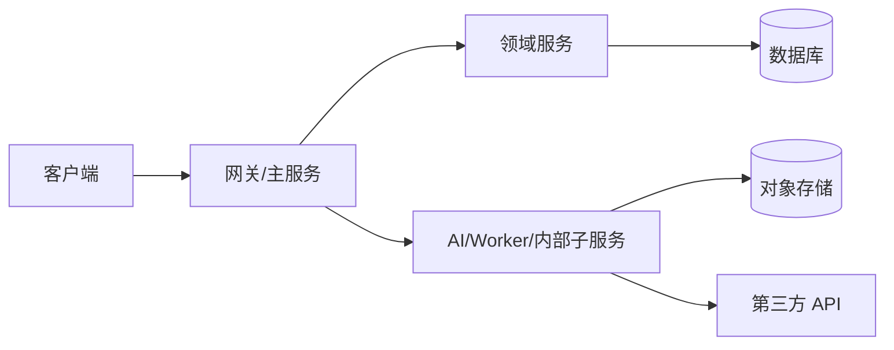
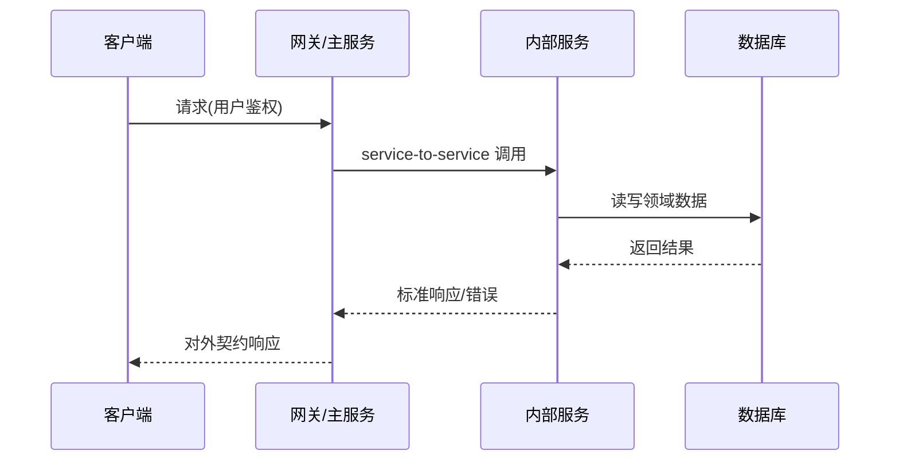

# {{项目名称}} 技术架构设计

## 0. 版本历史

| 版本 | 日期 | 变更内容 | 变更原因 | 影响 |
|------|------|----------|----------|------|
| v0.1 | YYYY-MM-DD | 初始版本 | 待定 | 待定 |

## 1. 当前决策

- 当前技术决策：
- 当前自研边界：
- 当前实施边界：

## 2. 分层架构

必须说明分层架构和允许的调用方向：

- 客户端层只能调用网关/主服务/API server，不得直连内部子服务。
- 网关/主服务负责客户端 API 契约、鉴权代理、用户上下文、CORS/网络边界、环境路由、降级与错误格式。
- 领域服务、AI/Worker/子服务、邮件服务、对象存储、第三方 API 只能通过主服务编排或受控 service-to-service 调用暴露能力。
- Dida 项目中，客户端只能调用 `dida-core/service`；`dida-auth-service` 预发可命名为 `pre-dida-auth-service`，生产使用正式 `dida-auth-service` 或批准的生产 auth 域名。内部服务地址不得进入客户端包或客户端 `.env`。

## 3. 产品到技术映射

| 需求 ID | 技术能力 | 负责模块 | 数据落点 | 验证方式 |
|---------|----------|----------|----------|----------|
| REQ-001 | | | | |

## 4. 调用关系

必须使用 Mermaid 描述关键链路，不用表格替代调用图。

## 5. 数据模型

## 6. API 契约

## 7. 自研边界与选型

## 8. 防腐化约束

- 约束 1：
- 约束 2：
- 约束 3：

## 9. 失败处理、重试与回滚

## 10. 未解决问题

- 待定
